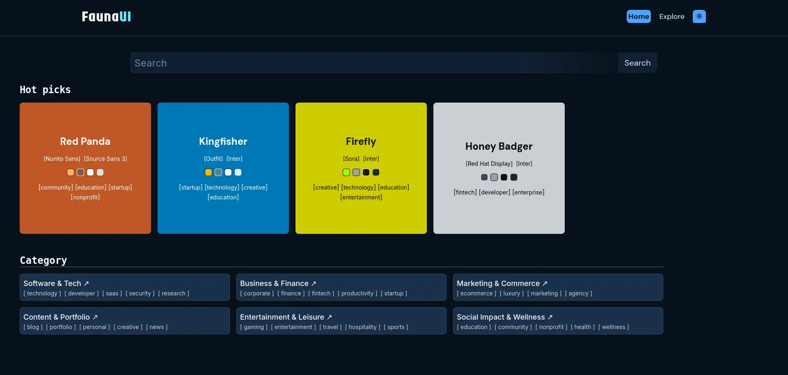
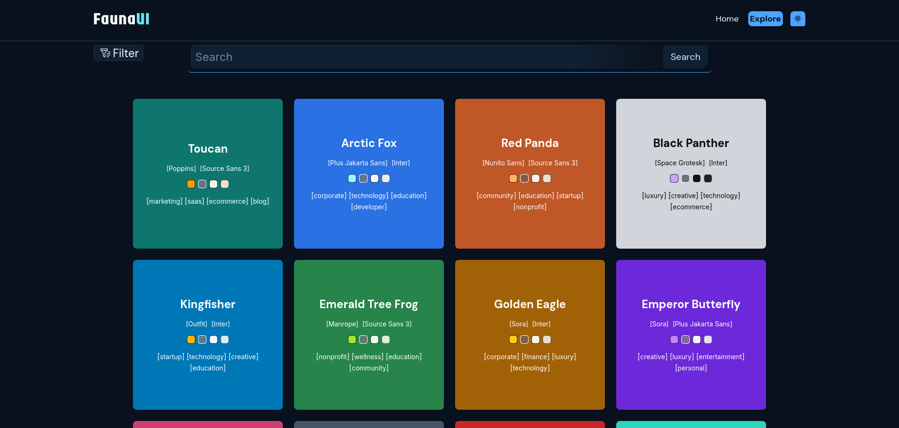
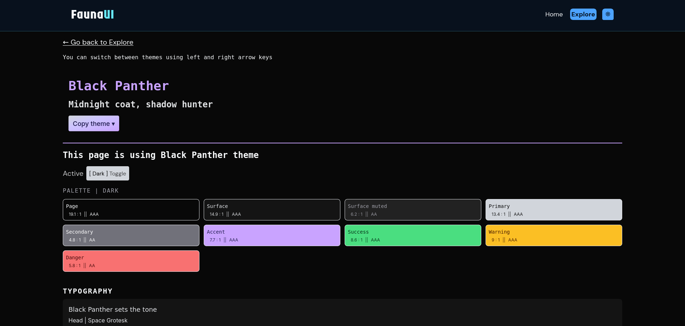
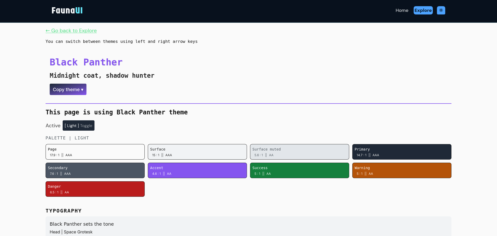
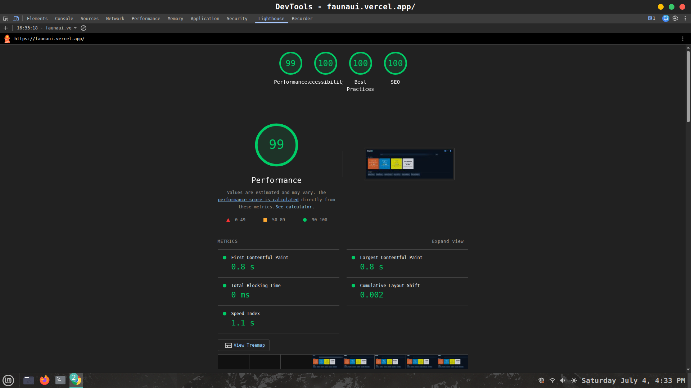

# FaunaUI 🐋

Pick an accessibility-verified color theme and get back to your editor — no digging through palette generators, no guessing at contrast ratios.

**[Live Demo →](#https://faunaui.vercel.app)**

## Screenshots

| Home — filter by category | Explore — browse with use cases |
|---|---|
|  |  |

| Theme page — live contrast scores | Export panel |
|---|---|
|  |  |

## What it does

FaunaUI is a theme picker for developers and designers. Instead of generating a palette and hoping it's accessible, you browse 40 animal-inspired palettes that are already built around WCAG contrast standards, see the actual numbers before you commit, and export in whatever format you need.

# AIM
My AIM was to get the color and fonts under 1-2 minutes and get back to work/code editor.

## Features

- **40 animal-inspired palettes**, each with a light and dark mode
- **Live WCAG contrast scores** on every text/background pairing — see the AA/AAA rating before you use a combination, not after
- **OKLCH color format** for perceptually consistent color (fixes the "why does this blue look brighter than that blue" problem you get with hex/HSL)
- **In-built contrast engine** — no color library dependency, contrast math is calculated directly
- **Custom OKLCH → hex conversion** for Figma export, since Figma doesn't support OKLCH import yet. it gives colors in hex instead
- **Multiple export formats**: CSS custom properties, a drop-in Tailwind config, or Figma-ready hex — copy light mode, dark mode, or both at once
- **Font imports handled separately** via preconnect, so added fonts don't slow down the site they're going into
- **Discovery tools**: filter by site category on the Home page, or browse theme-by-theme on the Explore page with suggested use cases attached to each palette
- **Keyboard navigation** — arrow keys move between themes on a theme page

## Tech stack

React · TypeScript · Tailwind CSS

## Performance

Lighthouse audit: **99 Performance / 100 Accessibility / 100 Best Practices / 100 SEO**

## How the palettes are built

Each palette starts from a core color per animal theme, expanded using color wheel harmony rules (triadic/complementary) to get a working set of related colors. From there, lightness and saturation are adjusted so the primary/accent/secondary colors hold the right relationship to each other, and every resulting pairing is checked against WCAG contrast requirements before it ships. If a pairing doesn't pass, it gets adjusted — not discarded — so the palette keeps its color identity while staying accessible.

## License

[MIT License]
